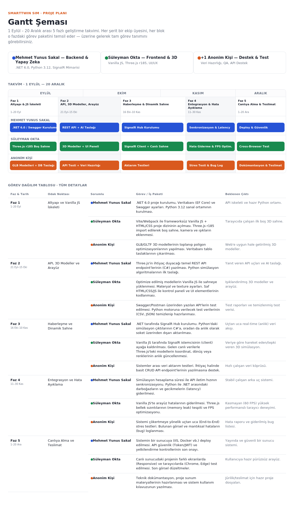

# SmartTwin Sim — Proje Gantt Şeması

Endüstri 4.0 / Dijital İkiz projesi **SmartTwin Sim**'in geliştirme takvimini ve ekip görev dağılımını gösteren, tek dosyalık interaktif Gantt şeması.

### 🔗 [Canlı Demo](https://smarttwin41.github.io/smarttwin_sim_gantt/)

---

## Proje Hakkında

Bu Gantt şeması, **1 Eylül – 20 Aralık** tarihleri arasındaki 5 fazlı geliştirme sürecini; her ekip üyesinin sorumluluklarını ve teslim edilecek çıktıları tek ekranda görselleştirir. Görev bloklarının üzerine gelindiğinde (hover) tam görev açıklaması tooltip olarak görünür; altındaki tabloda ise tüm fazlar, görevler ve beklenen çıktılar detaylı şekilde listelenir.

## Özellikler

- 📅 5 fazlık zaman çizelgesi (Eylül – Aralık), ay bazlı eksen
- 🎨 Ekip üyesine göre renk kodlu şeritler (mavi / yeşil / turuncu)
- 🖱️ Görev bloklarında hover ile tam açıklama (tooltip)
- 📋 Altında tüm görevleri, sorumluları ve çıktıları listeleyen detaylı tablo
- ⚡ Framework yok — tek `index.html` dosyası sayesinde kurulum gerektirmez

## Ekip

| Renk | İsim | Rol |
|---|---|---|
| 🔵 | Mehmet Yunus Sakal | Backend & Yapay Zeka — .NET 6.0, Python 3.12, SignalR Mimarisi |
| 🟢 | Süleyman Okta | Frontend & 3D — Vanilla JS, Three.js r185, UI/UX |
| 🟠 | +1 Anonim Kişi | Destek & Test — Veri Hazırlığı, QA, API Destek |

## Faz Takvimi

| Faz | Tarih | Odak |
|---|---|---|
| Faz 1 | 1 – 20 Eylül | Altyapı ve Vanilla JS İskeleti |
| Faz 2 | 21 Eylül – 15 Ekim | API, 3D Modeller ve Arayüz |
| Faz 3 | 16 Ekim – 10 Kasım | Haberleşme ve Dinamik Sahne |
| Faz 4 | 11 – 30 Kasım | Entegrasyon ve Hata Ayıklama |
| Faz 5 | 1 – 20 Aralık | Canlıya Alma ve Teslimat |

## Lisans

Bu proje OKTA INTRALOGISTICS şirketinin SmartTwin ekibinin iç kullanımı içindir. 
